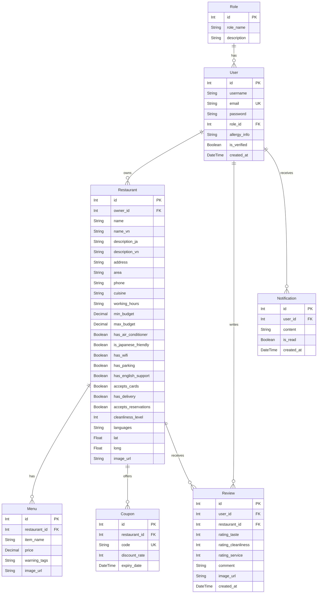

# Frontend (`apps/web`)

Next.js frontend application for JV Dine.

## Prerequisites

- Node.js 20+
- pnpm 10.11.0

## Local setup

From repo root:

```bash
pnpm install
cp apps/web/.env.example apps/web/.env.local
pnpm dev:web
```

Default URL is `http://localhost:3000`. Visiting `/` opens the guest home/search screen, while `/login` and `/signup` remain dedicated auth routes.

If port **3000** is already taken, Next picks another (e.g. **3001**). The API defaults to port **5000** (`NEXT_PUBLIC_API_BASE_URL`).

## Language toggle

The home and auth screens use a client-side JP/VN language toggle stored in `localStorage`. There are no locale-prefixed routes yet.

## Environment variables

Use `apps/web/.env.local` (from `apps/web/.env.example`):

```env
NEXT_PUBLIC_API_BASE_URL=http://localhost:5000
NEXT_PUBLIC_GOOGLE_MAPS_API_KEY=
NEXT_PUBLIC_GOOGLE_MAPS_MAP_ID=
```

`/map` requires both Google Maps variables. If either is missing, the page renders a configuration error instead of mounting the map.

## Commands

From repo root:

```bash
pnpm dev:web
pnpm --filter web dev
pnpm --filter web build
pnpm --filter web start
pnpm --filter web lint
```

From `apps/web`:

```bash
pnpm dev
pnpm build
pnpm start
pnpm lint
```

## Test status

There is no frontend `test` script yet in `apps/web/package.json`.



