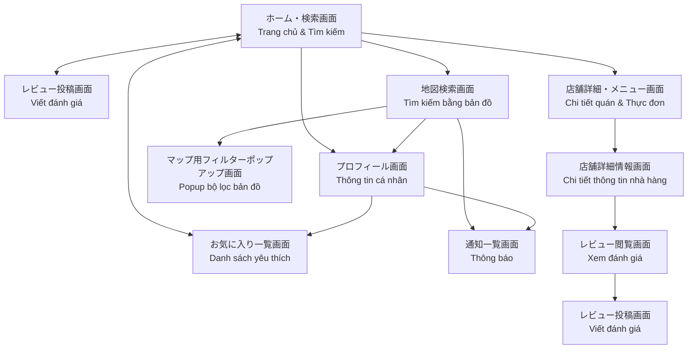
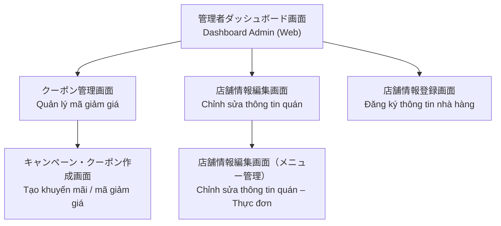
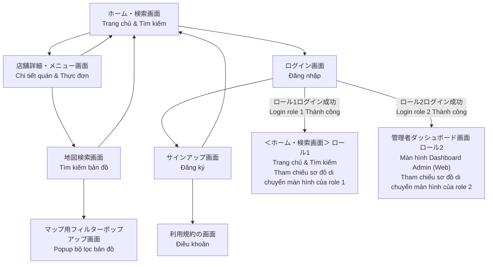

# 02 — 画面遷移図 / Sơ đồ chuyển màn hình

> Sheet `画面遷移図` — sheet 2/14. Bản gốc trong Excel chỉ chứa header role; bản vẽ thật là 3 diagram nằm trong `xl/drawings/drawing2.xml`. Dưới đây là phiên bản tương đương dùng Mermaid, mỗi diagram cho một role.

## Quy ước

- Tên màn hình giữ nguyên format `JP / VN`.
- Cạnh có mũi tên = chuyển hướng một chiều (trigger thường là click nút / link / submit).
- Cạnh hai chiều = mở popup hoặc back được.
- Mỗi diagram bám sát đúng các shape và connector trong `drawing2.xml`.

## Role 1 — 一般ユーザー / Người dùng thường (khách Nhật)

**Điểm chính (Role 1):**

- `ホーム・検索画面` là trung tâm — mở được Detail / Map / Profile / Favorites.
- `店舗詳細・メニュー画面` là gateway tới `店舗詳細情報` (text info) và `レビュー閲覧` (review list).
- Từ list đánh giá có thể chuyển sang form viết đánh giá (`レビュー投稿画面`).
- `お気に入り一覧画面` mở được từ cả Home và Profile (đường tắt).

## Role 2 — 店舗管理者 / Chủ nhà hàng (Web Admin)

**Điểm chính (Role 2):**

- `管理者ダッシュボード画面` là trang điều hướng trung tâm (sau khi Owner login thành công).
- Từ Dashboard có 3 nhánh chính: quản lý coupon, sửa thông tin quán, đăng ký quán mới.
- `クーポン管理画面` là nơi liệt kê mã, click "Tạo mới" mở `キャンペーン・クーポン作成画面`.
- `店舗情報編集画面` mở thêm `店舗情報編集画面（メニュー管理）` để CRUD món ăn.

**Web (`apps/web`) — route tương ứng (Sprint 2):**

- `管理者ダッシュボード画面` → `/dashboard`
- `店舗情報編集画面` → `/dashboard/restaurants/{id}/edit` (tab 基本情報 + form PATCH `restaurants`)
- `店舗情報編集画面（メニュー管理）` → `/dashboard/restaurants/{id}/menu` (placeholder; CRUD món sẽ theo backlog メニュー)

## Role 3 — ゲスト / Guest (chưa login) — bao gồm flow Auth chung

**Điểm chính (Role 3 — Guest & Auth):**

- Guest có thể duyệt `ホーム・検索画面`, `店舗詳細・メニュー画面`, `地図検索画面` mà không cần login.
- Khi cần thao tác cần xác thực (đăng review, save favorites, owner work…), Guest bị chuyển sang `ログイン画面`.
- `ログイン画面` nhánh sang `サインアップ画面` (chưa có tài khoản) và bắt buộc đồng ý `利用規約の画面` trước khi tạo tài khoản.
- Sau login thành công:
  - Role 1 → quay về `ホーム・検索画面` (vào sơ đồ Role 1).
  - Role 2 → tới `管理者ダッシュボード画面` (vào sơ đồ Role 2).
- `マップ用フィルターポップアップ画面` mở dạng popup từ `地図検索画面`.

## Tổng hợp

| Tuyến chính | Cụm role |
|---|---|
| Discovery (Home → Map / Detail / Reviews) | Role 1 + Role 3 |
| User-only (Profile, Notifications, Favorites, Write review) | Role 1 |
| Authentication (Login / Signup / Terms) | Role 3 → Role 1 hoặc Role 2 |
| Owner workflow (Dashboard → Edit / Register / Menu / Coupon / Campaign) | Role 2 |
