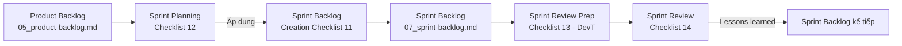

# 08 — Sprint Process Checklists

> Tổng hợp 4 sheets quản lý quy trình Scrum (sheets 11–14/14).
>
> | Sheet | Tên | CSV | Section bên dưới |
> |---|---|---|---|
> | 11 | スプリントバックログ作成チェックリスト | `csv/11_*.csv` | [§1 Sprint Backlog Creation](#1-スプリントバックログ作成チェックリスト--checklist-tạo-sprint-backlog) |
> | 12 | スプリントプランニングチェックリスト | `csv/12_*.csv` | [§2 Sprint Planning](#2-スプリントプランニングチェックリスト--checklist-sprint-planning) |
> | 13 | スプリントレビュー準備チェックリスト（開発T用） | `csv/13_*.csv` | [§3 Sprint Review Prep (DevT)](#3-スプリントレビュー準備チェックリスト開発t用--checklist-chuẩn-bị-sprint-review-devt) |
> | 14 | スプリントレビューチェックリスト | `csv/14_*.csv` | [§4 Sprint Review](#4-スプリントレビューチェックリスト--checklist-sprint-review) |

## 1. スプリントバックログ作成チェックリスト / Checklist tạo Sprint Backlog

11 mục để DevT tự kiểm khi lập Sprint Backlog. Cột S01 / S02 / S03 trong file gốc tương ứng Sprint 1–3; ✅ = `True`, ❌ = `False`.

| No | Mục | Quan điểm | S01 | S02 | S03 |
|---:|---|---|:---:|:---:|:---:|
| 1 | 日付 / Ngày | Khoảng thời gian sprint điền đúng chưa | ✅ | ❌ | ❌ |
| 2 | スプリントゴール / Sprint Goal | Có ghi đúng nội dung đã thống nhất với POT không | ✅ | ❌ | ❌ |
| 3 | スプリントバックログ / Sprint Backlog | Không để trống các cột "PID liên quan", "ID", "Task", "PIC", "Ước lượng", "Liên quan đến mục tiêu Sprint" | ✅ | ❌ | ❌ |
| 4 | タスク / Task | Mỗi task có thực sự góp phần đạt sprint goal không | ✅ | ❌ | ❌ |
| 5 | タスク数 / Số task | Số task có thể hoàn thành trong 1 sprint không | ✅ | ❌ | ❌ |
| 6 | PIC | Có thành viên nào bị quá tải không | ✅ | ❌ | ❌ |
| 7 | 前回からのタスク / Task từ sprint trước | Các task phát sinh từ báo cáo tiến độ sprint trước có được ghi đầy đủ không | – | ❌ | ❌ |
| 8 | スペルチェック / Chính tả | Không có lỗi chính tả / ghi sai | ✅ | ❌ | ❌ |
| 9 | 表記ゆれ / Thống nhất từ ngữ | Cùng nghĩa với từ ở Spec / Product Backlog mà không ghi khác | ✅ | ❌ | ❌ |
| 10 | 言語 / Ngôn ngữ | Có cả JP + VN | ✅ | ❌ | ❌ |
| 11 | 体裁 / Layout | Không ô trống / đường kẻ vỡ | ✅ | ❌ | ❌ |

> **Trạng thái thực tế**: chỉ Sprint 1 đã có dữ liệu thực; Sprint 2, 3 vẫn ở dạng template (chưa fill content) → toàn bộ ❌.

---

## 2. スプリントプランニングチェックリスト / Checklist Sprint Planning

Sheet này chia 2 luồng song song: **POT** và **開発T (DevT)**. Mỗi bên có 6 bước, cùng "Time" (phút) ước lượng. Cột giữa "Talk/Task" cho biết bước đó là cùng thảo luận hay làm task riêng.

### Luồng POT

| No | Time | Việc cần làm (Todo) | Căn cứ đánh giá | ✓ |
|---:|:---:|---|---|:---:|
| 1 | 3p | Quyết định vai trò trong team | Đảm bảo toàn bộ thành viên nắm được nội dung Sprint Planning theo realtime | ✅ |
| 2 | 7p | POT thảo luận để quyết Sprint Goal tạm thời | Độ ưu tiên & độ lớn của các PBI, nội dung "sprint goal" đã chuẩn bị | ✅ |
| 3 | 5p | Thảo luận với DevT để chốt Sprint Goal; báo cáo miệng cho giáo viên sau khi DevT điền xong | Thời gian DevT có thể dành; sprint goal tạm điều chỉnh nếu cần | ✅ |
| 4 | 25p | Q&A với DevT để xác nhận tính hợp lý của các task; tham khảo Sprint Backlog Creation Checklist | Task có liên quan trực tiếp đến sprint goal? AC của P_ID đã đầy đủ task chưa? Spec / PB có thiếu thông tin không? | ✅ |
| 5 | 5p | Kiểm tra toàn bộ Sprint Backlog, không có vấn đề thì duyệt + báo cáo trên Slack | Sprint backlog có thể đạt sprint goal không? DevT làm trong 1 tuần được không? | ✅ |
| 6 | – | (Nếu xong sớm) Rà soát Spec / PB, sửa nếu thiếu, share lại cho DevT | Có đủ thông tin để DevT phát triển không | ✅ |

### Luồng 開発T (DevT)

| No | Time | Việc cần làm (Todo) | Căn cứ đánh giá | ✓ |
|---:|:---:|---|---|:---:|
| 1 | 3p | Quyết định vai trò trong team | Như POT | ✅ |
| 2 | 7p | Xác nhận xem mỗi member có thể dev được bao nhiêu giờ / tuần | Schedule + năng lực kỹ thuật + skill AI của từng người (người không code có thể làm Tester…) | ✅ |
| 3 | 5p | Thảo luận với POT để chốt Sprint Goal, ghi vào Sprint Backlog bằng tiếng Việt | Như trên + nội dung "sprint goal" đã chuẩn bị (nếu yêu cầu của POT giống sample NG → FB lại đề xuất chỉnh sửa) | ✅ |
| 4 | 25p | Từ Sprint Goal lọc ra task cần thiết, ghi vào Sprint Backlog tiếng Việt; tham khảo Sprint Backlog Creation Checklist | Như POT (cần thiết FB ngay nếu Spec/PB thiếu thông tin) | ✅ |
| 5 | 5p | Chốt bản tiếng Việt của Sprint Backlog (tiếng Nhật chưa cần) | Sprint backlog có thể đạt sprint goal? Khả năng hoàn thành 1 tuần (đề xuất bổ sung task nếu còn dư) | ✅ |
| 6 | – | (Nếu xong sớm) Bổ sung tiếng Nhật vào Sprint Backlog + tick ✅ vào Sprint Backlog Creation Checklist; share POT nếu phải sửa | Đã đạt được từng mục trong Sprint Backlog Creation Checklist chưa | ✅ |

### Lưu ý cho POT

- Nếu Spec/PB có thiếu sót → trách nhiệm chậm tiến độ thuộc **POT** chứ không phải DevT.
- Nếu sửa Spec/PB không kịp → cân nhắc bỏ task tương ứng + chỉnh lại Sprint Goal.
- DevT nói "khó nên không làm được" → **không chấp nhận**; yêu cầu giải bằng AI.
- Nếu DevT ít hỏi → POT chủ động hỏi để align nhận thức:
  - "Task này, làm đến mức nào thì xem là hoàn thành?"
  - "Chức năng này tuần sau có thể demo không?"
  - "Để hiện thực chức năng này thì phát triển những màn hình nào?"

### Lưu ý cho DevT

- Kiểm tra mọi thông tin cần dev (như Spec) đã đủ chưa; có chỗ chưa rõ → confirm ngay trong Sprint Planning.
  - Nếu sau khi bắt đầu dev mới phát hiện chưa rõ → mất thời gian hỏi POT, có thể chậm tiến độ.
- DevT không được nói "khó nên không làm được" → giải bằng AI.
- Mọi task: cần align với POT về điều kiện hoàn thành.
- Khi sửa task: cùng POT kiểm tra xem có cần sửa Sprint Goal không.
- Sprint Goal & Sprint Backlog **viết tiếng Việt trước**, sau khi chốt mới bổ sung tiếng Nhật.

---

## 3. スプリントレビュー準備チェックリスト（開発T用） / Checklist chuẩn bị Sprint Review (DevT)

Checklist 14 mục dành cho DevT trước khi đến Sprint Review. Cột S01 / S02 / S03 + 教師FB tương ứng Sprint 1–3 (đều ❌ vì chưa có sprint nào hoàn tất).

| No | Mục | Nội dung kiểm tra |
|---:|---|---|
| 1 | スプリントバックログ | Tiến độ + thực tế không bị bỏ trống |
| 2 | 進捗 | Tiến độ điền đúng định nghĩa (100% = dev xong + test xong + không bug; 80% = dev xong, test chưa; 60/40/20 = các mức dở; 0% = chưa bắt đầu) |
| 3 | 問題点 | Điền đầy đủ với case: tiến độ ≠ 100%, thực tế > ước lượng, hoặc trong dev có hỏi POT |
| 4 | 原因 | Phân tích nguyên nhân từ nhiều góc độ (mục không có vấn đề thì để trống được) |
| 5 | 対策 | Giải pháp phù hợp với nguyên nhân, cụ thể + khả thi (không chấp nhận "cố gắng hơn") |
| 6 | 問題点への対応状況 | Điền cho các mục có vấn đề |
| 7 | スプリントレビュー準備 | Đã điền đủ: người giải thích / demo / memo, mức đạt sprint goal + lý do |
| 8 | スプリントレビュー準備 | Mức đạt + lý do có hợp lý so với tiến độ Sprint Backlog không |
| 9 | スペルチェック | Không có lỗi chính tả |
| 10 | 表記ゆれ | Không ghi từ khác cho cùng nghĩa giữa Spec / PB |
| 11 | 言語 | JP + VN |
| 12 | 体裁 | Không ô trống / kẻ vỡ |
| 13 | 説明準備 | Đã chuẩn bị nội dung giải thích dễ hiểu cho mọi task |
| 14 | デモ準備 | Đã chuẩn bị demo chứng minh đạt sprint goal + AC của Product Backlog |

---

## 4. スプリントレビューチェックリスト / Checklist Sprint Review

Tương tự Sprint Planning Checklist (mục 2), sheet này cũng chia POT / DevT.

### Luồng POT

| No | Time | Việc cần làm | Căn cứ đánh giá |
|---:|:---:|---|---|
| 1 | 10p | Check Sprint Backlog + "mức đạt sprint goal" + "lý do"; FB tiếng Việt nếu thiếu | Có ghi thiếu gì không |
| 2 | – | Kiểm tra "vấn đề – nguyên nhân – biện pháp" do DevT ghi có hợp lý không; nếu có vấn đề / chưa rõ → FB tiếng Việt | Biện pháp có (a) ngăn case lặp lại, hoặc (b) dễ giải quyết nếu lặp lại không |
| 3 | – | Dựa trên FB, xác nhận / hỏi DevT | Tiến độ + vấn đề + tình trạng xử lý của Sprint Backlog |
| 4 | 15p | (← Thảo luận →) DevT trả lời FB | DevT có trả lời ngay rõ ràng không (nếu cần xem xét, được phép trả lời "Tôi sẽ check + reply trước ngày … giờ …") |
| 5 | – | Xem demo của DevT, có vấn đề / chưa rõ → confirm + FB tiếng Việt | Demo có cho thấy đạt sprint goal + AC; có khớp Spec / Screen Transition; tiến độ Sprint Backlog ↔ demo có khớp không |
| 6 | 8p | Đối với mọi FB của POT, ghi tiếng Việt "FBへの対応方針" + "対応する内容/対応しない理由" | Câu trả lời có rõ ràng + cụ thể không |
| 7 | – | Check "Hướng xử lý FB" + "Nội dung xử lý / lý do không xử lý" do DevT ghi; OK thì tick "対応方針承認" | Mọi FB đã có câu trả lời? Có rõ + cụ thể không? |
| 8 | 2p | Check "Những điểm cải thiện ở sprint tiếp theo" do DevT ghi; OK thì tick "POTは上記の内容を妥当であると判断し、このスプリントレビューを承認します。" | FB sprint này có được phản ánh không |
| 9 | – | (Nếu xong sớm) Bổ sung tiếng Nhật cho mọi nội dung POT đã ghi | – |

### Luồng 開発T (DevT)

| No | Time | Việc cần làm | Căn cứ đánh giá |
|---:|:---:|---|---|
| 1 | – | (Trong khoảng thời gian này, mọi nhóm hoạt động với vai trò POT) | – |
| 4 | 15p | (← Thảo luận →) Trả lời FB từ POT | Theo Sprint Review Prep Checklist mục No.12 |
| 5 | – | (1) Thực hiện demo (2) Trả lời FB từ POT | Theo Sprint Review Prep Checklist mục No.13 |
| 6 | 8p | Ghi sprint goal achievement + lý do bằng tiếng Việt; cập nhật trạng thái Product Backlog | Dựa trên kết quả No.2–5 |
| 7 | – | Check "FBへの対応方針" / "対応する内容/対応しない理由" do DevT đã ghi | Mọi FB đã có câu trả lời? Có rõ + cụ thể không? |
| 8 | 2p | Lắng nghe FB từ POT | – |
| 9 | – | (Nếu xong sớm) Bổ sung tiếng Nhật cho mọi nội dung DevT đã ghi | – |

---

## Trình tự dòng chảy 4 checklist

> Mỗi sprint là một vòng lặp: lập kế hoạch → tự kiểm Sprint Backlog → thực thi → chuẩn bị review → review với POT → rút kinh nghiệm cho sprint tiếp theo.
